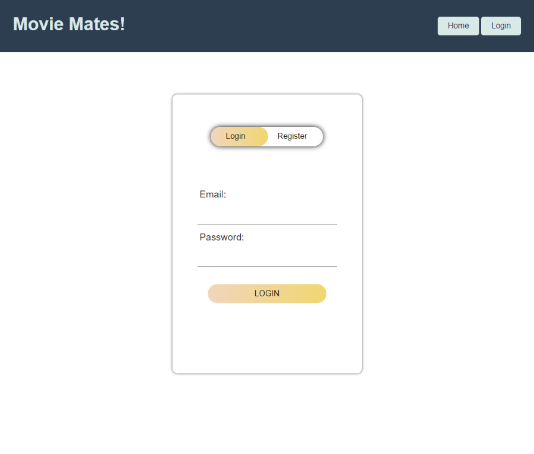
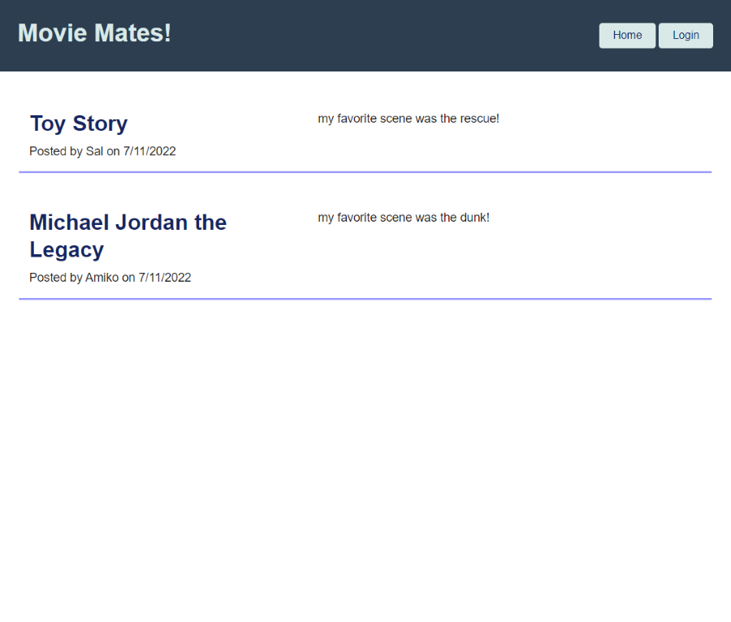

<h1 align="center">Movie Mates!</h1>

## Description

AS A movie viewer
I WANT a social app for movies	
SO THAT I can access information, comment, rate and chat about them!

The purpose of our app is for users to create an account using a new username and create reviews of movies of different genres they may search for.
In addition to reviewing movies, the application also allows for real-time chat giving users an opportunity to have open discussions with other users that demonstrate similar tastes in film and cinema.

## Website Link

https://moviemates-deployer.herokuapp.com/

### Login/Register User

### Homepage (With Other Users' Reviews)

### Dashboard of User (With Existing Posts, and Create New Review)

### Search Functionality for Movies

### Post New Review

## Installation Parameters

`npm i` allows for necessary installation of miscellaneous packages. `mysql -u root -p` and `source db/schema.sql` are necessary for login to mySQL, and initialization of the database. Finally, `npm run seed` and `node server.js` is used, both to seed the database and initialize the app. (Seeding is not necessary, but helps with visualizing the constructed tables withing our database.) 

## Functions
The homepage welcomes the user with previous ratings made by other users 
The app manages to seamlessly take you through the log in and registration page when the user indicates a need to create a profile. 
Once that is set up, it then allows for the user to move through the search engine to look up movies using the IMDB API.
Logged in members can choose to chat with another person with similar views by clicking a chat feature using Socket.IO.

## Future Development 
We were working towards, but did not fully achieve a fully polished review system. We would like to incorporate a neater UI, with abilities to edit, delete, and update via CRUD pathways.

For future development we'd like to add more variety with the ratings system. Maybe in a 1-5 range, similar to Yelp?

We'd like to add the ability to start group forums. Chat functionality was only achieved locally so to replicate in a larger environment like Heroku made things more difficult. We can explore other means to create chat, perhaps with React or other computer languages.

Adding a recommend feature to connect users to specific group forums is something we might like to include.
